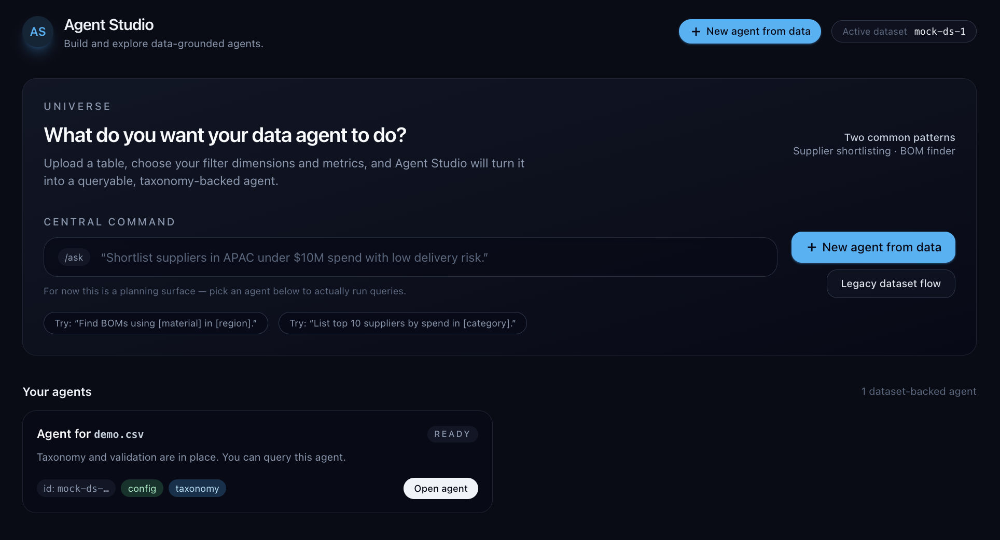
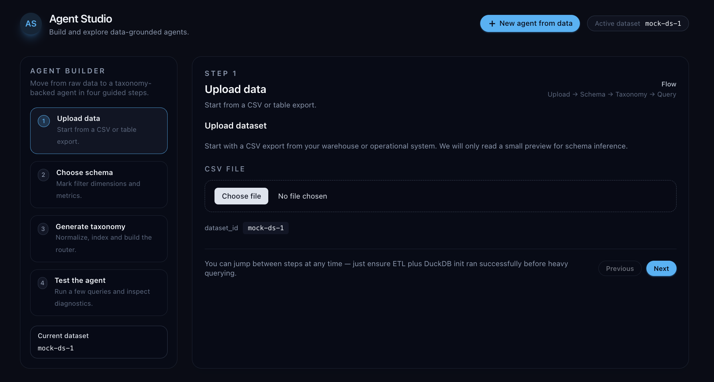
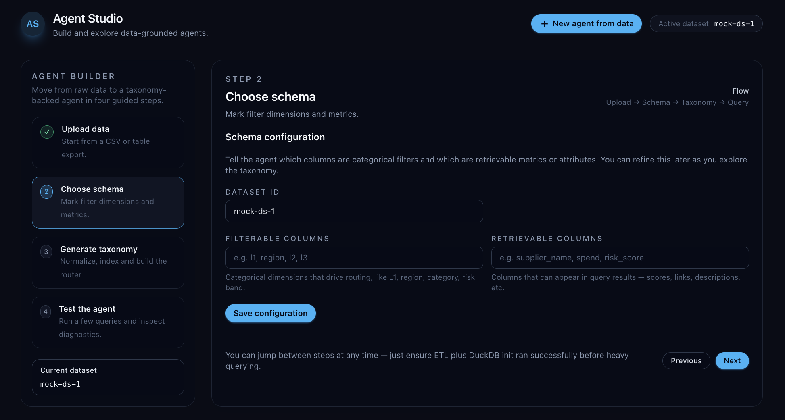
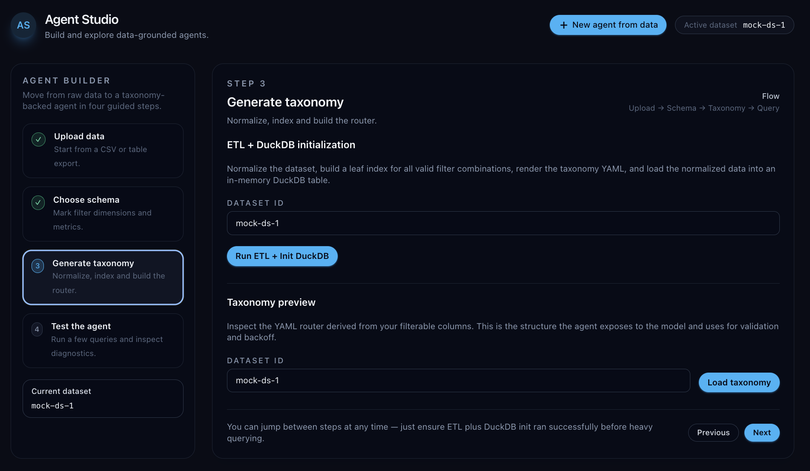
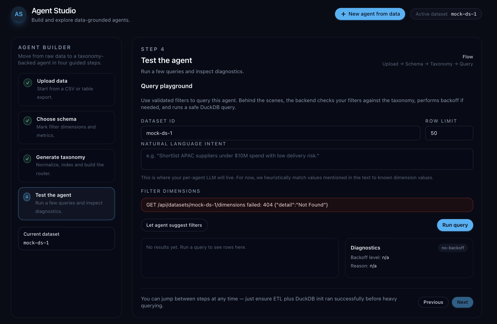

# Business Analyst Agent Builder

A lightweight agentic IDE for business analysts that lets you connect to real data, define tools around it, and spin up AI agents to explore, query, and automate workflows without heavy engineering support.

Building tooling on this to let you build scalable, data native agents, and surface them as MCP Servers for use in any MCP Client platform (Claude, GPTs, etc.)

## Common use cases
- Supplier discovery and segmentation – Quickly search across massive supplier databases, enrich profiles, and group suppliers by capability, geography, risk, or performance based on unstructured descriptions and metadata.
- Taxonomy-based material classification – Map messy material descriptions to a standard taxonomy (UNSPSC, custom schemas), flag inconsistencies, and suggest normalized categories for downstream analytics.
BOM and spec mining – Parse bills of materials and technical specifications to pull out key attributes (materials, tolerances, dimensions, compliance tags) and answer targeted questions without manually reading every line.
- Contract and document tagging – Extract key terms, clauses, and attributes from contracts, SOWs, or policy documents and tag them into structured fields for faster analysis and reporting.
- Ad-hoc data Q&A for projects – Stand up a temporary agent on top of project data (files, tables, exports) so teams can ask natural language questions, get repeatable answers, and avoid rebuilding bespoke one-off analyses.

## Key differentiator

Most “SQL agents” and generic data copilots assume clean, dense tables and spend a lot of time guessing filters, exploring schemas, and issuing trial-and-error queries—behavior that quickly breaks down on real consulting datasets that are wide, sparse, and full of edge cases. This system flips that pattern: it lets you predefine trusted, business-meaningful data slices (leaves), expose them with metadata, and then have the agent route over those leaves instead of inventing queries from scratch. In practice, that means fewer wasted tool calls, faster and more stable responses, and agent behavior that matches how BAs actually think about segments, cohorts, and shortlists in the real world.

## What it looks like

**Home – create a new agent**

**Step 1 – name and describe your agent**

**Step 2 – connect data and tools**

**Step 3 – configure prompts and behaviors**

**Step 4 – review and launch**

## Leaf-based routing (why it scales)

Instead of letting the agent blindly explore tables, we give it a set of **valid leaves**. A leaf is a precomputed slice of data (like “XX suppliers in APAC, with revenue > $Y”) that we know actually contains one or more rows. Together, these leaves act as a truthful “map” of what data exists.

We also store **metadata** for each leaf (e.g., region, category, data quality), so the agent can see which leaves have the best and most complete data.

For example, imagine a supplier shortlisting agent on top of a table classified by category, region, and revenue. If you ask:

> “Find me XX suppliers in Australia”

The agent can:

- See all leaves for this dataset (e.g., “XX suppliers – Americas”, “XX suppliers – APAC”, “XX suppliers – Global”) and notice that **no leaf exists for Oceania/Australia**.
- Skip wasting tool calls trying random filters for “Australia” that would return empty results.
- Instead, automatically select a sensible fallback leaf (e.g., “XX suppliers – Global including Americas and APAC”) and explain to the user that no Australia-specific leaf exists, but it can still give a valid global or regional list.

This approach:

- Gives the agent a scalable understanding of the schema without guessing.
- Solves for LLMs not knowing which values to filter on or which filter combinations actually have data behind them.
- Works especially well on **sparse or expansive datasets**, where there are many possible filter combinations, but only a subset actually have matching entries.

## Future plans

- Build out the backend and create a demo friendly hosted product.
- Publish a gallery of reusable agent blueprints for common BA workflows
- Improve collaboration features like sharing agents as MCP Server details.
- Harden backend APIs and add lightweight auth so it’s easier to deploy in team environments
